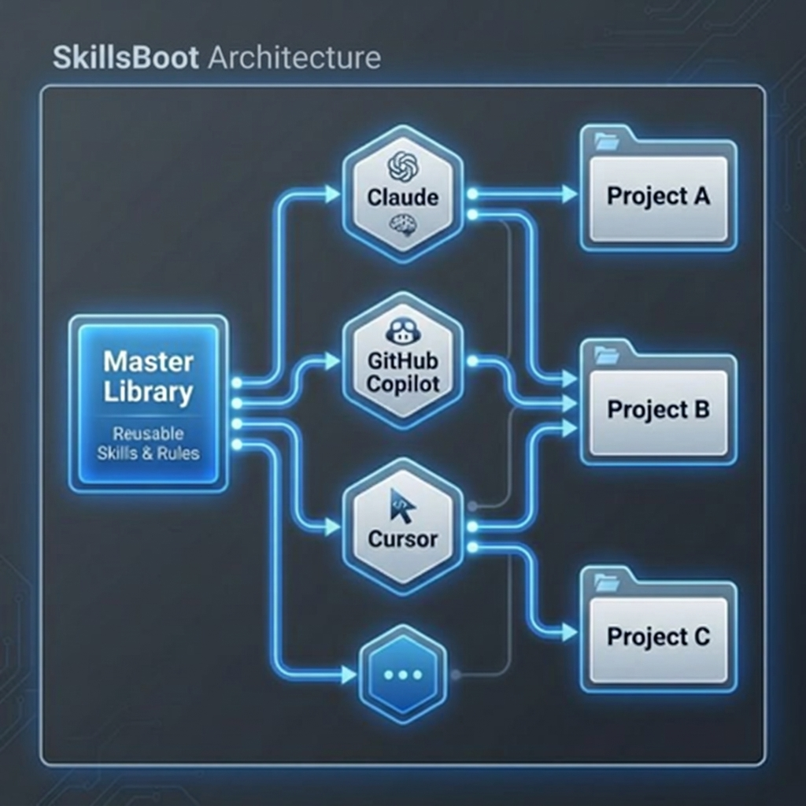

# SkillsBoot 🚀

**One source of truth for your AI instructions. Initialize once, share across projects, and switch seamlessly between different AI agents like GitHub Copilot, Claude Code, Cursor and ...**

SkillsBoot is a VS Code extension that solves the "instruction fragmentation" problem. Instead of copy-pasting `.clinerules` or `AGENTS.md` between folders, you maintain a central library of **Master Instructions** and surgicaly link them to your projects.

---

## ✨ Why SkillsBoot?

- **📦 One Source of Truth**: Stop managing duplicate rule files. Edit in one place, and your changes reflect everywhere instantly.
- **🌐 Cross-Project Sharing**: Standardize your coding style, architectural patterns, and specialized skills across every repository in your workspace.
- **🔄 Instant Agent Switching**: Want to switch a project from Claude Code to GitHub Copilot? Just flip a toggle. SkillsBoot handles the re-mapping of Instructions, and SKILLS automatically.

---

## 🛠 How It Works

SkillsBoot acts as a central distribution hub for your AI context:

### The Three-Step Architecture

1.  **Master Templates**: Your instructions are stored in a standardized format (containing `rules/`, `skills/`, etc.) in your home directory (`~/.skillsboot/templates`).
2.  **Tool Variants**: When you "Apply" an instruction to a project, SkillsBoot generates a "Variant"—a version of your template transformed for a specific tool (like Cline).
3.  **Symlinks**: SkillsBoot creates symbolic links in your project that point to these variants. This means your AI agent sees its rules exactly where it expects them, but the "Source of Truth" remains central.
---

## 📂 Supported Tools/Config

SkillsBoot recognizes and standardizes configuration for the following agents in project level:

| Agent | AGENTS.md | Skills |
| :--- | :--- | :--- |
| **GitHub Copilot** | `AGENTS.md` | `.github/skills/` |
| **Claude Code** | `CLAUDE.md` | `.claude/skills/` |
| **Kilo** | `AGENTS.md` | `.kilocode/skills/` |
| **Cline** | `AGENTS.md` | `.clinerules/skills/` |
| **Cursor** | `AGENTS.md` | `.cursor/skills/` |
| **Codex** | `AGENTS.md` | `.agents/skills/` |
| **Windsurf** | `AGENTS.md` | `.windsurf/skills/` |

*More tools are being added regularly!*
---

## 🚀 Usage

### 1. The Activity Bar
Find the **Rocket Icon** in your VS Code Activity Bar to open the SkillsBoot Manager.

### 2. Initializing a New Instruction
Click **"New"** to scaffold a fresh instruction. You can choose which components (Rules, Skills, etc.) to include based on the target tool's capabilities.

#### 2.1. Importing Existing Rules
Click **"Import"** when you are in a project that already has rules. SkillsBoot will:
- Detect the tool being used.
- Offer to move those files to your central library.
- Replace the local project files with symlinks.

### 3. Linking & Unlinking
Use the dropdown on each instruction card to link it to the current project or switch between different tools (e.g., switch a project from "Cline" to "GitHub Copilot" mode).

---

## 🔧 Installation & Setup

1. Install the extension in VS Code.
2. Open the SkillsBoot view in the Activity Bar.
3. Start by creating your first "Master Instruction" or importing one from an existing project.
